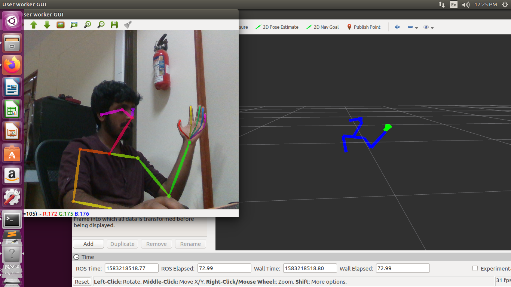
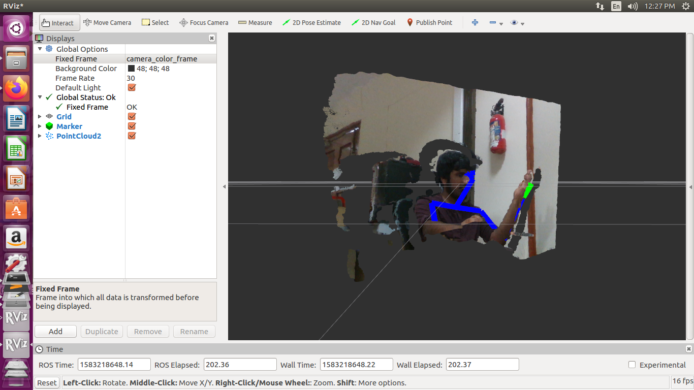

# openpose_ros

Example ROS catkin package that utilizes the OpenPose library from https://github.com/CMU-Perceptual-Computing-Lab/openpose for 3D pose estimation.

## System
Tested on:
* Ubuntu 16.04
* ROS Kinetic
* CUDA 10.0
* cuDNN 5.1 / cuDNN 6.0 / cuDNN 7.2.4 / cuDNN 7.5.0
* OpenCV 3.3

## Installation Steps

1. Clone OpenPose somewhere not in your catkin_workspace.
   ```bash
   git clone https://github.com/CMU-Perceptual-Computing-Lab/openpose.git
   ```
2. IMPORTANT: OpenPose tend to change their API frequently, so I can only guarantee that it will work with certain versions of OpenPose. Currently I have updated this ros wrapper to work with commit d78ae77. You can use get that version by running the following commands:
   ```bash
   cd openpose
   git checkout d78ae77
   ```
3. Install openpose using instructions from here: https://github.com/CMU-Perceptual-Computing-Lab/openpose/blob/d78ae77fa660fdf75300a5ff1aebab0783052c7b/doc/installation.md. Make sure to run `sudo make install` in the build folder at the end.
4. Clone this repository into your catkin_workspace/src directory.
   ```bash
   git clone https://github.com/firephinx/openpose_ros.git
   ```
5. Modify the model_folder line in openpose_ros/src/openpose_flags.cpp to where openpose is installed (line 30).
   ```bash
   DEFINE_string(model_folder,             "/path/to/openpose/models/",      "Folder path (absolute or relative) where the models (pose, face, ...) are located.");
   ```
6. Modify the image_topic and depth_topic parameter in openpose_ros/launch/openpose_ros.launch to the image_topic you want to process.
   ```bash
   <param name="image_topic"     value="/camera/image_raw" />
   <param name="depth_topic"     value="/camera/depth/image_raw" />
   ```
7. Modify the other parameters in openpose_ros/src/openpose_flags.cpp and openpose_ros/launch/openpose_ros.launch to your liking such as enabling face and hands detection.
8. Run `catkin build` from your catkin_workspace directory.

## Running
```bash
source catkin_workspace/devel/setup.bash
roslaunch openpose_ros openpose_ros.launch
```

# 3D




## TODO

1. Make changes to detect only one human in frame.
2. Organize visualization code.
